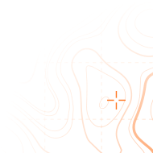
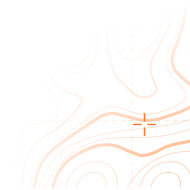
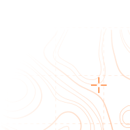
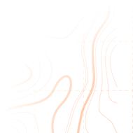
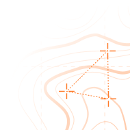

# OUR NOTORIOUS OPERATIONS

## Gatekeeper 5
* 2246
* A riot pacification mission
* 

### BRIEF INFO
An insurrection happened on “Vonkl” agro station. The station belonging to Asencio corp became mutinous because of a fresh shift of workers. Their unlawful demands were met with a swift but powerful response from the Private Club riot squad that was able to pacify the situation within two days. Fortunately, only a few dozen workers were harmed and no permanent damage to the station was done.  Although some say that the results were slightly less than ideal, we think that our execution was flawless.   Both CEO and Owner of the station highly commended our service.

| LOSSES | DURATION | STATUS |
|--------|----------|--------|
| 1%     | 13 DAYS  | SUCCESS|

## Operation Revival
* 2247
* A reclamation effort for one of the oldest space dock stations
* 

### BRIEF INFO
PC PMC were tasked to clear out the infamous “Karharn” space dock that was drifting in space for almost a decade and got occupied by all sorts of pirates and other scum. In swift and decisive action our operators were able to destroy all hostile forces thus removing the pirate threat for good. Sadly, the dock itself was lost in a series of unfortunate explosions, which we had no part in. We are proud that no PMC personnel was lost during this operation.

| LOSSES | DURATION | STATUS |
|--------|----------|--------|
| 2%     | 30 DAYS  | SUCCESS|

## The Red Sands
* 2248
* A joint operation with USOL security forces
* 

### BRIEF INFO
Our company was hired as a security detail for the evacuation of several VIP figures from Mars, during the uprising. Needless to say that it was one of the first missions which granted us our reputation as a solid executors as well as the highest merit award from our clients.

| LOSSES | DURATION | STATUS |
|--------|----------|--------|
| 0%     | 4 DAYS   | SUCCESS|

## Operation  Safety net
* 2249
* One of the few public operations of our “Cyberlaw” squads
* 

### BRIEF INFO
The squad was tasked with acquiring information about the terrorist organization “free food and beverage front” that attacked multiple food warehouses in several colonies demanding more “honest” food distribution.
						
As a result of our squad operation all of the terrorists were found and arrested.
						
Despite later claims by human rights activists our company takes no responsibility for the deaths of those terrorists as they have been properly delivered to the local security forces.

| LOSSES | DURATION | STATUS |
|--------|----------|--------|
| 0%     | 9 DAYS   | SUCCESS|

## Party like a millionaire
* 2250
* An annual event held on Luna
* 

### BRIEF INFO
Our Security detail is well known for protecting mass events such as the “Locomotion” festival held on Luna. Last year our detail effectively blocked any contraband alcohol and drugs usage by arresting all known dealers.  At the same time, together with our partners we were able to provide the best quality entertainment service to the attendees.

| LOSSES | DURATION | STATUS |
|--------|----------|--------|
| 0%     | 2 DAYS   | SUCCESS|

## Eye of Arran
* 2251
* An intelligence gathering operation in the asteroid belt
* 

### BRIEF INFO
Our intelligence service was tasked with observation over problematic mining stations HZ-12 and HZ-15. That process led the owners to a realisation that a potential uprising was going to happen, instigated by unknown individuals who recently came to both stations.
As a result, a pacification squad (not related to PC PMC) was sent and the uprisings were quelled at their birth. Our service was highly commended by the employers.

| LOSSES | DURATION | STATUS |
|--------|----------|--------|
| 3%     | 17 DAYS  | SUCCESS|

# ARCHIVE

| | OPERATION | TARGET | KEY INFO | RESULT |
|-|-----------|--------|----------|--------|
| | Silver Vault Orbital Trade Station | Escort and protection of a high-value cargo module | LOSSES: 0% DURATION: 36 hours| SUCCESS |
| | Sapphire Veil Classified | Personal protection of a billionaire | LOSSES: 0% DURATION: 48 hours | SUCCESS |
| | Velvet Shield Luna | Security provision for a diplomatic delegation | LOSSES: 0% DURATION: 24 hours | SUCCESS |
| | Diamond Current Classified | Protection of a research team and their data | LOSSES: 0% DURATION: 96 hours | SUCCESS |
| | White Paragon Classified | Security of a rare artifact collection | LOSSES: 0% DURATION: 30 hours | SUCCESS |

Older operations available only upon request. Contact our acquisition center